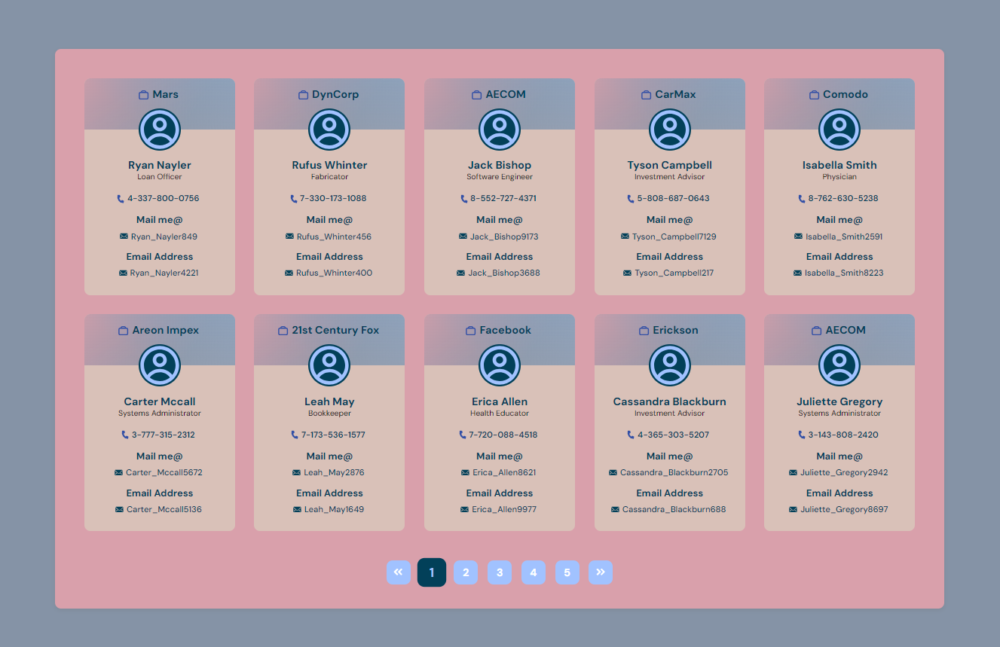

<!-- Please update value in the {}  -->
<h1 align="center">Enableit 🎆</h1>

  <h3>
    <a href="https://enablit-pagination-ui.netlify.app/" target="_blank">
     >> Demo <<
    </a>   
  </h3>

<!-- OVERVIEW -->

## Overview

### About

- This is a frontend task given by **Enablit**.
- The task was to build this pagination UI from the provided api.

### Built With

<!-- This section should list any major frameworks that you built your project using. Here are a few examples.-->

- REACT
- Typescript
- CSS
- Netlify

### Run Code

#### `npm start`

Runs the app in the development mode.\
Open [http://localhost:3000](http://localhost:3000) to view it in your browser.

The page will reload when you make changes.\
You may also see any lint errors in the console.

## Contact

- Website [ScriptoPlankton](https://sandeep.netlify.app/)
- GitHub [@sandeepashok](https://github.com/sandeepashok)
- Gmail [Sandeep98a@gmail.com](sandeep98a@gmail.com)
